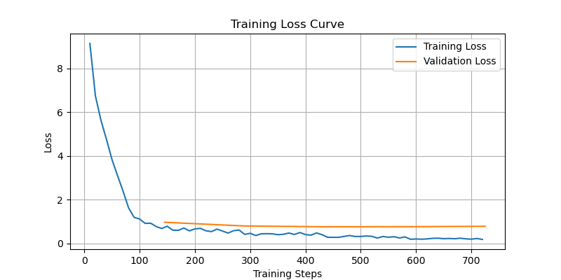
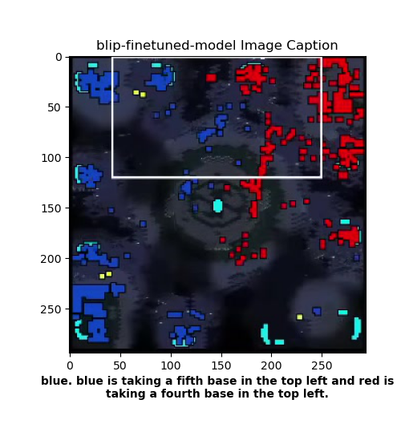

# Image-Captioning Tactical Advisor Model (ICTAM)

<h2>1. Introduction</h2>
  ICTAM was my first attempt at applying pretrained LLMs to tactical analysis and advisory tasks. This work was inspired by <a href="https://www.science.org/doi/10.1126/science.ade9097">CICERO</a> and <a href="https://arxiv.org/abs/2312.11865">LLMs play sc2</a>. I primarily wanted to test the pretrained capabilities of image captioning models and see if they could make accurate tactical judgements with minimal supervised finetuning.

<h2>2. Data Processing</h2>
  My data pipeline consists of starcraft youtube video downloads from yt-dlp which feeds into image sampling and cropping using ffmpeg. I sample one image per minute (1/60 fps) as 1 frame should loosely describe the tactical state of the minimap for a minute although more sampling would be good. I crop the bottom left of the screen as that is where the minimap is. I then generate a .json caption file that stores a dictionary per image-caption pair. In order to enable tactical judgement evaluation, the captions were structured to start with "Winner. Followed by the rest of the caption."

  <div style="display: flex; justify-content: center; gap: 20px;">
    <div style="text-align: center;">
      
      <p><em>Sample Frame</em></p>
    </div>
    <div style="text-align: center;">
      
      <p><em>Sample Caption</em></p>
    </div>
  </div>

<h2>3. Training and Validation</h2>
  I did an 80-10-10 train-val-test split on my image-caption pairs. I then trained the BLIPConditionalGeneration model with the HuggingFace Trainer. This model was trained with a cross-entropy loss that compares a sequence of tokens against that same sequence shifted forward.

  <div align="center">
    
    <p><em>Train-Validation Loss Curves (validation only starts after the first epoch)</em></p>
  </div>

  <h2>4. Evaluation</h2>
    I evaluated the % of correct tactical judgement from BLIP by parsing the caption string, and creating a list of just the winner prediction before the ".". I then compared this list against the same list from the actual captions. ICTAM successfully identifies the "winning player color" 80% of the time across multiple test trials with the test dataset which ICTAM had not been trained on.
    <div style="display: flex; justify-content: center; gap: 20px;">
      <div style="text-align: center;">
        
        <p><em>blip-base caption inference result</em></p>
      </div>
      <div style="text-align: center;">
        
        <p><em>blip-finetuned caption inference result</em></p>
      </div>
    </div>
    <div style="text-align: center;">
      
      <p><em>ICTAM Tactical Judgement Accuracy</em></p>
    </div>


### Environment Setup
```bash
conda create -n ictam python=3.13 -y
conda activate ictam
pip install -r requirements.txt
```
### Running ICTAM Pipeline (Data Scraping/Processing --> Training/Validation --> Inference/Test)

Use [`image_caption_extraction.py`](./image_caption_extraction.py) to... 
- download youtube videos with yt-dlp
- crop images from those videos and sample them with ffmpeg
- generate image caption file that will need to be human-annotated

Use [`ictam_model.py`](./ictam_model.py) to...
- run inference with any HuggingFace Image-Captioning model you want (I used BLIP and GIT but it should for others with minimal changes.)
- finetune-train any HF Image Captioning Model to make tactical analysis captions
- test finetune-trained model's tactical judgement and analysis capabilities


<!-- 
ICTAM was my first attempt at applying pretrained LLMs to tactical analysis and advisory tasks. This work was inspired by [CICERO](https://www.science.org/doi/10.1126/science.ade9097) and [LLMs play sc2](https://arxiv.org/abs/2312.11865). In this project I generated a 723 image + caption dataset of starcraft minimaps and expert-annotated tactical description captions. I then 80-10-10 train-val-test split the dataset, and finetune-trained BLIP, on my data. BLIP is an image captioning model trained with an image-conditioned Cross Entropy Loss. The captions intentionally start with a winner (player color) followed by a period to enable downstream evaluation of ICTAM's tactical judgement (picking the winning/favored player per image). An example caption can be seen below. ICTAM is able to identify the "winning player color" 80% of the time across multiple test trials with the test dataset (data ICTAM had never seen).

<div align="center">
  
  <p><em>Example caption — not the winner declaration followed by a period and the rest of the caption.</em></p>
</div>

<div align="center">
  
  <p><em>Training and Validation Curves showing convergence (HuggingFace Trainer only starts validating after the first epoch)</em></p>
</div>

<div align="center">
  
  <p><em>ICTAM's tactical judgement testset evaluation results (for how many images does it correctly identify the winner?)</em></p>
</div>

<div style="text-align:center">
  
  
  <p><em>Left/Before BLIP-base model's caption and Right/After my trained model's caption.</em></p>
</div> -->
