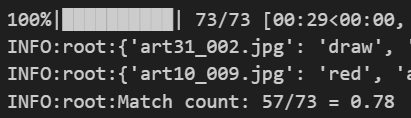
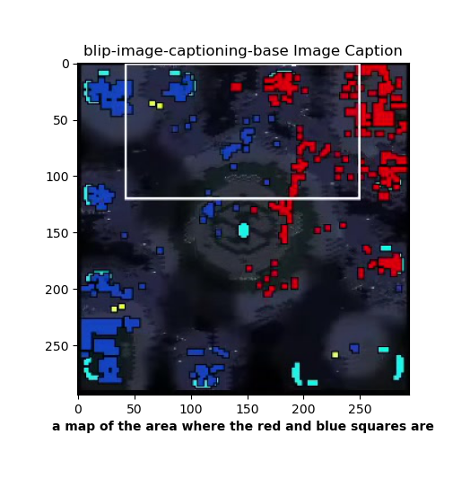

# Image-Captioning Tactical Advisor Model (ICTAM)

ICTAM was my first attempt at applying pretrained LLMs to tactical analysis and advisory tasks. This work was inspired by [CICERO](https://www.science.org/doi/10.1126/science.ade9097) and [LLMs play sc2](https://arxiv.org/abs/2312.11865). In this project I generated a 723 image + caption dataset of starcraft minimaps and expert-annotated tactical description captions. I then 80-10-10 train-val-test split the dataset, and finetune-trained BLIP, on my data. BLIP is an image captioning model trained with an image-conditioned Cross Entropy Loss. The captions intentionally start with a winner (player color) followed by a period to enable downstream evaluation of ICTAM's tactical judgement (picking the winning/favored player per image). An example caption can be seen below. ICTAM is able to identify the "winning player color" 80% of the time across multiple test trials with the test dataset (data ICTAM had never seen).


<p>Example caption, not the winner declaration followed by a period and the rest of the caption.</p>


<p>Training and Validation Curves showing convergence (HuggingFace Trainer only starts validating after the first epoch)</p>


<p>ICTAM's tactical judgement testset evaluation results (for how many images does it correctly identify the winner?)</p>


<div style="text-align:center">
  
  
</div>
<p>Left/Before BLIP-base model's caption and Right/After my trained model's caption.</p>


### Environment Setup
```bash
conda create -n ictam python=3.13 -y
conda activate ictam
pip install -r requirements.txt
```
### Running ICTAM Pipeline (Data Scraping/Processing --> Training/Validation --> Inference/Test)

Use [`image_caption_extraction.py`](./image_caption_extraction.py) to... 
- download youtube videos with yt-dlp
- crop images from those videos and sample them with ffmpeg
- generate image caption file that will need to be human-annotated

Use [`ictam_model.py`](./ictam_model.py) to...
- run inference with any HuggingFace Image-Captioning model you want (I used BLIP and GIT but it should for others with minimal changes.)
- finetune-train any HF Image Captioning Model to make tactical analysis captions
- test finetune-trained model's tactical judgement and analysis capabilities